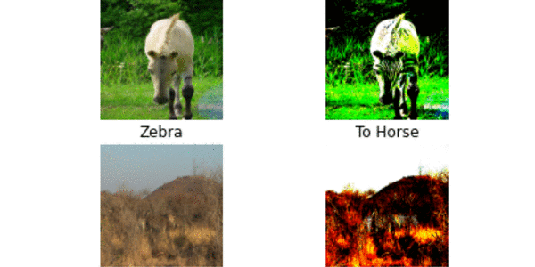

# CycleGAN
This repository includes a tensorflow implementation of CycleGAN. In this tutorial we try to translate horses into zebras and zebras into horses. For the generator network we use modified unet model implementation from tensorflow. CycleGAN has been only trained for 50 epochs. If you want your model to be really good then you should run it for more epochs.

* Epochs : 50
* Learning rate: 0.0002
* Batch size: 1
* Lambda for L1 loss = 100

# Results
