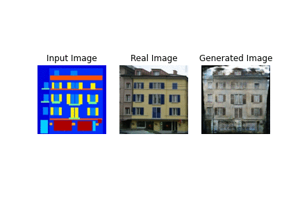

# Pix2Pix(CGAN)
This repository includes a tensorflow implementation of Pix2Pix(CGAN) on CMP Facade dataset. It's been only trained for 150 epochs. If you want your model to be really good then you should run it for more epochs.

* Epochs : 150
* Learning rate: 0.0002
* Batch size: 1
* Lambda for L1 loss = 100

# Results
