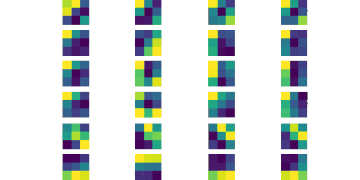
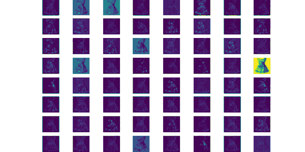

# Debuggin CNNs aka BlackBox
This repository includes a visualization of CNNs using tensorflow. A pretrained VGG19 network is used for this purpose.

# Visualizations
* Input Image: 

* Filters: 

* Feature Maps: 
