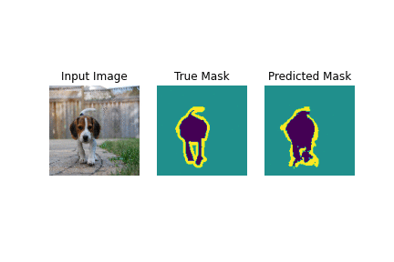

# CycleGAN
This repository includes a tensorflow implementation of Image Segmentation network. The model being used here is a modified U-Net. In-order to learn robust features, and reduce the number of trainable parameters, a pretrained model for the encoder is used. The encoder is a pretrained MobileNetV2 model, whose intermediate outputs are used, and the decoder consists of the upsample blocks already implemented in TensorFlow Examples in the Pix2pix tutorial. The decoder has been only trained for 20 epochs. If you want your model to be really good then you should run it for more epochs.

* Epochs : 20
* Learning rate: 0.0002
* Batch size: 64

# Results
