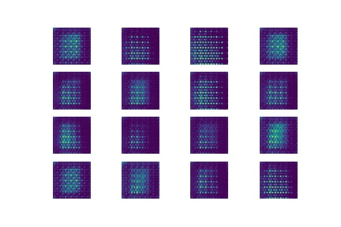

# GAN
This repository includes a tensorflow implementation of DCGAN on mnist dataset and it's been only trained for 50 epochs. If you want your model to be really good then you should run it for more epochs.

* Epochs : 50
* Learning rate: 0.0004
* Batch size: 256
* Noise Dimension: 100

# Results
